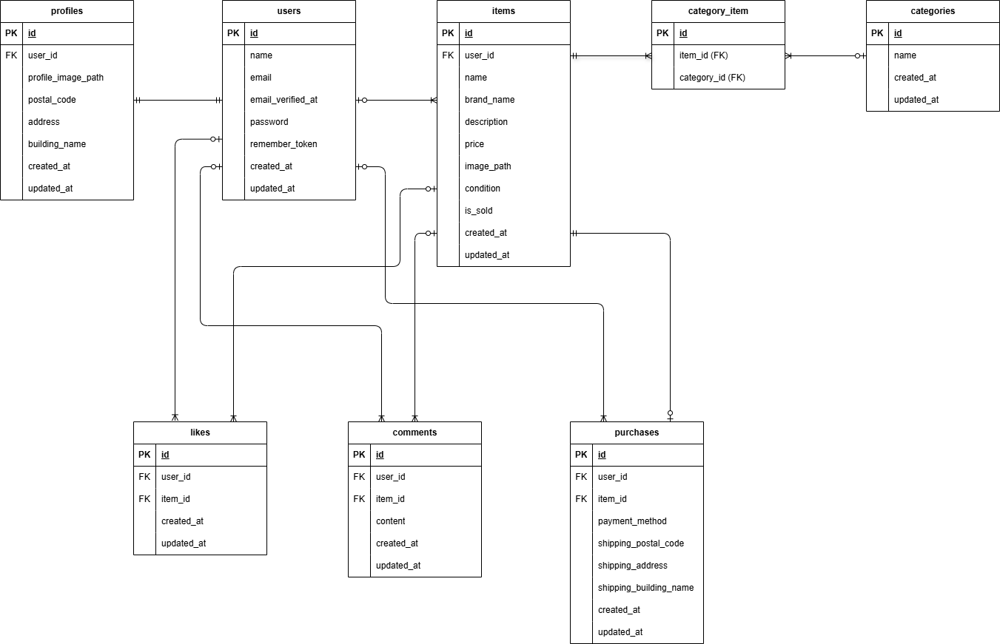

# coachtech-freemarket

フリマアプリの基本機能を実装したWebアプリケーションです。

---

## 環境構築

### Dockerビルド

1. リポジトリをクローン
```
git clone git@github.com:furamomo/coachtech-freemarket.git
```


2. DockerDesktopアプリを起動

3. コンテナの作成・起動
```
docker-compose up -d --build
```

---

### Laravel環境構築

1. PHPコンテナに入る
```
docker-compose exec php bash
```

2. Composerのインストール
```
composer install
```

3. 環境ファイル作成
```
cp .env.example .env
```

4..envに以下を設定
```
DB_CONNECTION=mysql
DB_HOST=mysql
DB_PORT=3306
DB_DATABASE=laravel_db
DB_USERNAME=laravel_user
DB_PASSWORD=laravel_pass
```

5.アプリケーションキーの作成
```
php artisan key:generate
```

6.マイグレーションの実行
```
php artisan migrate
```

7.シーディングの実行
```
php artisan db:seed
```

---

## 使用技術（実行環境）

- PHP 8.1
- Laravel 8.83.29
- MySQL 8.0.26
- nginx 1.21.1
- phpMyAdmin
- MailHog
- Stripe（決済）
- Docker / Docker Compose


---

## ER図



---

## URL

- 商品一覧：http://localhost/
- 会員登録：http://localhost/register
- ログイン：http://localhost/login
- phpMyAdmin：http://localhost:8080/
- MailHog：http://localhost:8025/
